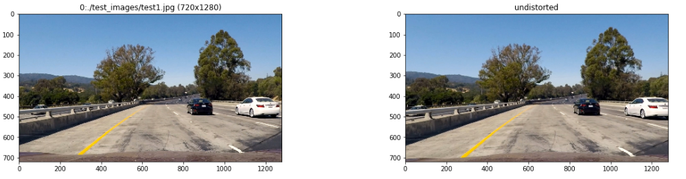
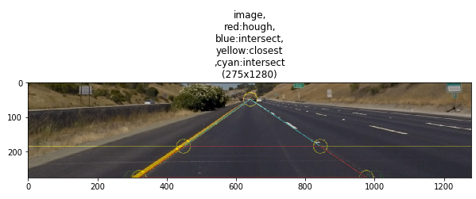

<!---
## Writeup Template

### You can use this file as a template for your writeup if you want to submit it as a markdown file, but feel free to use some other method and submit a pdf if you prefer.

---
-->
# Advanced Lane Finding Project**

The goals / steps of this project are the following:

* Compute the camera calibration matrix and distortion coefficients given a set of chessboard images.
* Apply a distortion correction to raw images.
* Use color transforms, gradients, etc., to create a thresholded binary image.
* Apply a perspective transform to rectify binary image ("birds-eye view").
* Detect lane pixels and fit to find the lane boundary.
* Determine the curvature of the lane and vehicle position with respect to center.
* Warp the detected lane boundaries back onto the original image.
* Output visual display of the lane boundaries and numerical estimation of lane curvature and vehicle position.

<!---
# (Image References)

[image1]: ./examples/undistort_output.png "Undistorted"
[image2]: ./test_images/test1.jpg "Road Transformed"
[image3]: ./examples/binary_combo_example.jpg "Binary Example"
[image4]: ./examples/warped_straight_lines.jpg "Warp Example"
[image5]: ./examples/color_fit_lines.jpg "Fit Visual"
[image6]: ./examples/example_output.jpg "Output"
[video1]: ./project_video.mp4 "Video"
-->
## [Rubric](https://review.udacity.com/#!/rubrics/571/view) Points

### Here I will consider the rubric points individually and describe how I addressed each point in my implementation.  
<!---
---

[//]: # (### Writeup / README)
[//]: # (CalibrateCamera.ipynb)
[//]: # (#### 1. Provide a Writeup / README that includes all the rubric points and how you addressed each one.  You can submit your writeup as markdown or pdf.  [Here](https://github.com/udacity/CarND-Advanced-Lane-Lines/blob/master/writeup_template.md) is a template writeup for this project you can use as a guide and a starting point.)

[//]: # (You're reading it!)
-->
### Camera Calibration

[//]: # (#### 1. Briefly state how you computed the camera matrix and distortion coefficients. Provide an example of a distortion corrected calibration image.)

The code for this step is contained in the IPython notebook located in
[CalibrateCamera.ipynb](https://github.com/autohandle/AdvancedLaneFinding/blob/master/CalibrateCamera.ipynb).

I start by preparing "object points", which will be the (x, y, z) coordinates of the chessboard corners in the world. Here I am assuming the chessboard is fixed on the (x, y) plane at z=0, such that the object points are the same for each calibration image.
Thus, `objectPoints` is just a replicated array of coordinates,
```python
# one entry for every interior point, each entry: x,y,x
objectPoints[:]=[ [x,y,0] for y in range(calibrationImageRows) for x in range(calibrationImageColumns) ]
```
and `allObjectPoints` will be appended with a copy of it every time I successfully detect all chessboard corners in a test image.
`allImagePoints` will be appended with the (x, y) pixel position of each of the corners in the image plane with each successful chessboard detection.  
I used `cv2.drawChessboardCorners` to decorate the chessboard and verify that the cornders were located.
A typical decorated chessboard:

All of the decorarted chessboards were
[saved](./output_images/cornersOnCalibrationImages.jpg).

I then used the output `allObjectPoints` and `allImagePoints` to compute the camera calibration and distortion coefficients using the `cv2.calibrateCamera()` function.
I applied this distortion correction to the test image using the `cv2.undistort()` function and obtained this typical result: 

The horizontal and vertical lines appear fairly perpendicular to the screen.
All of the undistorted images were [saved](./output_images/undistortedCalibrationImages.jpg)
[//]: # (![alt text][image1])
The calibration coefficients and  function to undistort the images were copied 
```python
CAMERAMATRIX = np.array([[  1.15730136e+03,   0.00000000e+00,   6.67042380e+02],
                        [  0.00000000e+00,   1.15270113e+03,   3.90488964e+02],
                        [  0.00000000e+00,   0.00000000e+00,   1.00000000e+00]])
DISTORTIONCOEFFICIENTS = np.array([[ -2.38666546e-01,  -2.98287548e-02,  -5.14437800e-04,  -1.76570650e-04, -4.55111368e-02]])
```
and saved in a [python file](./UndistortImage.py).
### Pipeline (single images)

#### 1. Distortion-corrected Image.

To demonstrate this step, I will describe how I apply the distortion correction to one of the test images like this one:



#### 2. Perspective Transform
I transferred most of the code in the Project 1 Lane Finding exercise to create the Perspective Transformation.
I saved that code in [WarpStraightLines.py](./WarpStraightLines.py).
To review, I started with the undistorted image:

I cropped the undistorted image to remove the sky:

I converted the cropped image to gray:

I used the road as a (seed) texture
```python
roadSeedPoints = [(int(croppedImageWidth/2),int(croppedImageHeight-10)),(0+10, croppedImageHeight-1-10), (croppedImageWidth-1-10, croppedImageHeight-1-10)]
```
to fill the roadway and then create a mask:

I used erode and dialate to fill the mask

I applied the mask to the cropped gray image to get a region of interest:

I used Sobel to find the edges:

I used Hough to locate lines

I found the Hough lines that intersected the baseline.
I searched right and left from the midpoint to locate the first intersection.
The first intersection will be the inside of the left and right lane markers (yellow circles).
I intersected the two lane markers to find the vanishing point (yellow circles).
The two baseline itersections and the vanishing point gave me a triangle.
I used an arbitrary horizontal line between the vanishing point and the baseline to create
the top of a trapezoid.

I did this for all of the staight line images and saved the [result](./output_images/perspectiveCalibrationImages.jpg).
I used points from the trapezoid to fashion a rectangle that inscribed the inside of the lane line markers.
`getPerspectiveTransform` to obtain the transformation.
i used the transformation to warp the straight line image

The trapezoid is embedded on the straight line image (in red) and the transformation warps
the trapezoid into a rectangle.

I used the same transformation to (un)warp the resulting image, so that it could be compared to the original.
I did this for all of the staight line images and saved the
[result](./output_images/perspectiveConfirmationImages.jpg).
I saved the transforms and the functions to warp and unwarp the images in [PerspectiveTransform.py](./PerspectiveTransform.py).
I applied the perspective transform to all the test images and saved the [result](./output_images/undistortedTestImages.jpg).
I tried several locations for the top of the trapezoid, the higher the trapezoid,
the more disperse the lane lines were at the top of the image. I settled on a top for the trapezoid
closer to the bottom of the image than I would have liked and didn't have to revisit my decision.

<!---
The code for my perspective transform includes a function called `warper()`,
which appears in lines 1 through 8 in the file `example.py` (output_images/examples/example.py)
(or, for example, in the 3rd code cell of the IPython notebook).
The `warper()` function takes as inputs an image (`img`),
as well as source (`src`) and destination (`dst`) points.
I chose the hardcode the source and destination points in the following manner:

```python
src = np.float32(
    [[(img_size[0] / 2) - 55, img_size[1] / 2 + 100],
    [((img_size[0] / 6) - 10), img_size[1]],
    [(img_size[0] * 5 / 6) + 60, img_size[1]],
    [(img_size[0] / 2 + 55), img_size[1] / 2 + 100]])
dst = np.float32(
    [[(img_size[0] / 4), 0],
    [(img_size[0] / 4), img_size[1]],
    [(img_size[0] * 3 / 4), img_size[1]],
    [(img_size[0] * 3 / 4), 0]])
```

This resulted in the following source and destination points:

| Source        | Destination   | 
|:-------------:|:-------------:| 
| 585, 460      | 320, 0        | 
| 203, 720      | 320, 720      |
| 1127, 720     | 960, 720      |
| 695, 460      | 960, 0        |

I verified that my perspective transform was working as expected by drawing the `src` and `dst` points onto a test image and its warped counterpart to verify that the lines appear parallel in the warped image.


![alt text][image4]
-->
#### 3. Color transforms, gradients and other methods to create a thresholded binary image.
I used color transforms and gradients to create a thresholded binary image. The routine enhanceLaneMarkers is in
[EnhanceLaneMarkers.py](./EnhanceLaneMarkers.py)
and is called from [LaneFinding.ipynb](./LaneFinding.ipynb). enhanceLaneMarkers returns the final [binary image]("./images/BinaryImage.png")
as well as several intermediate images:

enhanceLaneMarkers detects (its definition of) yellow and white. In addition, Sobel is used to detect edges.
All three threshold images are combined and then dialate and erode are used to fill in the detected colors and gradients.
I had reasonable performance on all the images, except Test1;

In Test1, the yellow is too light for me to pick up and I ran out of time to improve the performance here.
This will come back to bite me later, when the car goes over the concrete late in the video.
I spent a lot of time trying to avoid using a yellow detector since I considered this the color and gradient version
of "overfitting", but in the end, I had no choice. All of the test images can be viewed in [LaneFinding.ipynb](./LaneFinding.ipynb).

<!---
Provide an example of a binary image result.

I used a combination of color and gradient thresholds to generate a binary image
(thresholding steps at lines # through # in `another_file.py`).
Here's an example of my output for this step.  (note: this is not actually from one of the test images)

![alt text][image3]
-->
 
#### 4. Identified lane-line pixels and fit their positions with a polynomial
<!---
Then I did some other stuff and fit my lane lines with a 2nd order polynomial kinda like this:

![alt text][image5]
-->
 
To locate lane line pixels, I used the 2 step approach suggested [in class](./SlidingWindow.ipynb]:
1. Initialize the polynomial with sliding windows: `initializeSlidingWindows` routine in [ProcessImage.py](./ProcessImage.py)
2. Adjust the polynomial based on pixels in the old polynomial: `processImage` routine in [ProcessImage.py](./ProcessImage.py)

There were 3 steps in the `initializeSlidingWindows` routine in [ProcessImage.py](./ProcessImage.py).
1. A histogram is built along the X axis from the Y pixels in the image:  
                                                                            
   
   Histogram building performed well, even on Test Image 1:
   
                                                                            
2. The first maximum histogram value to the right and left are loacated
and then starting at the maximums, windows are stacked:                                                    
   
   Window stacking was suboptimal because the binary images were suboptimal
   
3. A polynomial was fit to the X and Y points collected from inside the windows (shown in yellow).                                                                   

The `processImage` routine in [ProcessImage.py](./ProcessImage.py)
1. The X pixels within MARGIN distance for each Y pixel are collected
2. The collected X and Y pixels are used in a quadratic regression to get new coefficients  
   
3. After the new polynomial was determined, the signed curvature was calcuated in the routine [calculateRadiusCurveInPixelsSigned](./ProcessImage.py).
   If the polynomial curve was not too small (`> MINPIXELCURVE`), the new coefficents were ignored and the old ones were kept.                                                              
4. The signed curvature was (re)calcuated and the new curvature was again checked against MINPIXELCURVE. In addition, the curvatures are compared with each other.
   If any the curvatures are "unexpected", the coefficients are (re)initialized by the `initializeSlidingWindows` routine in [ProcessImage.py](./ProcessImage.py).
                                                                            
I noticed that, usually, one of the lanes would be complete when the other one was not.
If the points could be combined, then there would be more samples to use in the polynomial regression,
they were after all, parallel.
I spent (way too much) time trying to move the points from one curve over to the other.
At first I thought I could just slide the points over like they were on a line, this failed miserably (see commented out code).
In the end, I determined that the point(s) needed to move along a perpendicular from one curve to the other.
At this point, my math skills and time allocation had been exceeded.
                                                                            
#### 5. Calculated the radius of curvature of the lane and the position of the vehicle with respect to center.
<!---
I did this in lines # through # in my code in `my_other_file.py`
-->
The radius of curvature of the lane and the position of the vehicle were determined by the routines `calculateCarOffset`
and `calculateRadiusCurveInPixelsSigned/calculateRadiusCurveInMeters` in [AnnotateImage.py](./AnnotateImage.py).
There are also other routines in [AnnotateImage.py](./AnnotateImage.py) to:
* fill in the lane on the warped image: fillLaneInTransformImage
* fill in the lane on the smaller warped image: fillLaneInVisualizationImage
                                                                            
#### 6. Example image of your result plotted back down onto the road such that the lane area is identified clearly.
Each frame is processed by the `processVideoFrame` routine in [ProcessVideoFrame.py](./ProcessVideoFrame.py).
`processVideoFrame` will start with `processInitialImage` routine in [ProcessImage.py](./ProcessImage.py)
and then `processImage` for subsequent images. Besides the processing, `processVideoFrame` will create the visualizations,
including the annotations, and then lay them out int the `plotFigure` routine from [AnnotateImage.py](./AnnotateImage.py).
                                                                            

                                                                            
<!---
I implemented this step in lines # through # in my code in `yet_another_file.py` in the function `map_lane()`.  Here is an example of my result on a test image:

![alt text][image6]

---
-->
                                                                            
### Pipeline (video)

#### 1. Link to final video output.
<!---
Your pipeline should perform reasonably well on the entire project video (wobbly lines are ok but no catastrophic failures that would cause the car to drive off the road!).

##### using the highly bias zero steering data
-->

The project video is processed a frame at a time in 10 second intervals in [ProcessProjectVideo.py](./ProcessProjectVideo.py)
which has the `processImage` routine used by the video clip processor
                                                                            
#### 2. Videos                                                                           
- normal [](http://www.autohandle.com/video/Driving.mp4)
- smaller [](http://www.autohandle.com/video/DrivingSmaller.mp4)

<!---                                                                           
Here's a [link to my video result](./project_video.mp4)

---
-->
### Discussion

#### 1. Briefly discuss any problems / issues you faced in your implementation of this project.  Where will your pipeline likely fail?  What could you do to make it more robust?

<!---
Here I'll talk about the approach I took, what techniques I used, what worked and why, where the pipeline might fail and how I might improve it if I were going to pursue this project further.  
-->
In retrospect, I should:
- (re)visit the binary threshold creation (see discussion in: Color transforms, gradients and other methods).
- look closer at combining parallel lines samples to have more (maybe twice as many) data points to regress against,
and mitigate lane dropout (see discussion in: Identified lane-line pixels).
